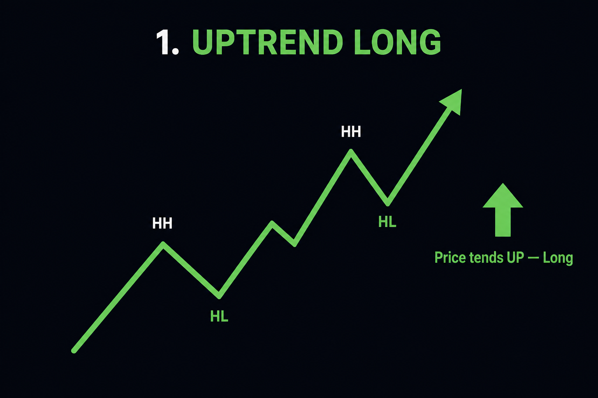
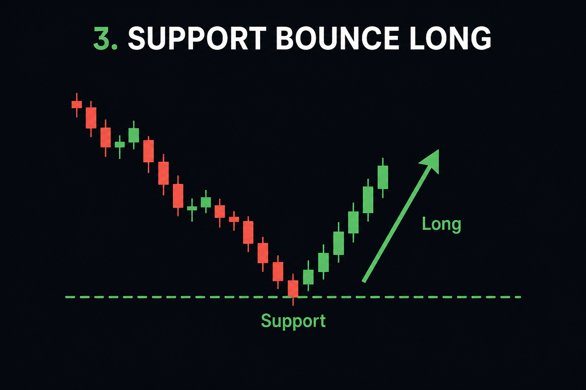
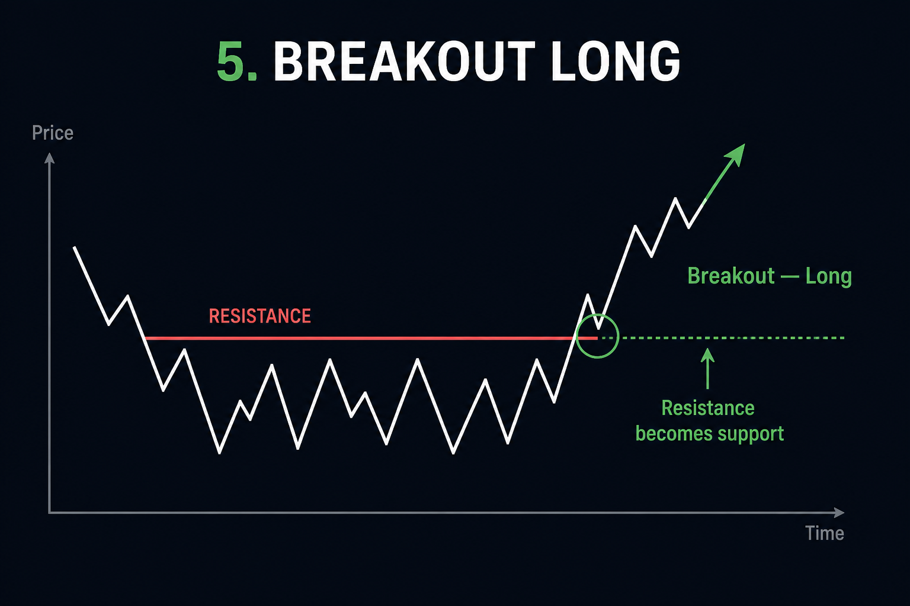
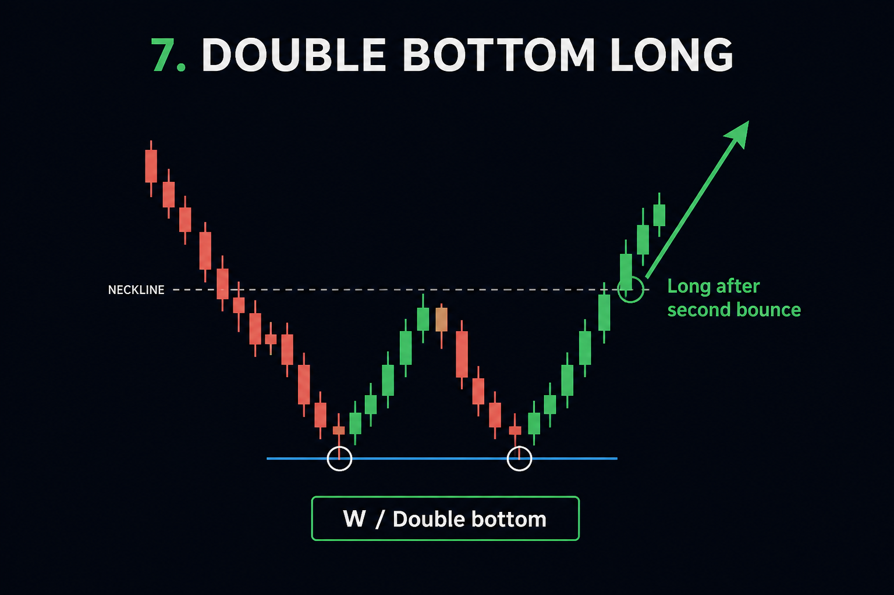
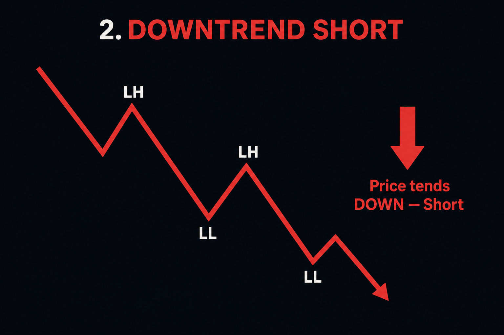
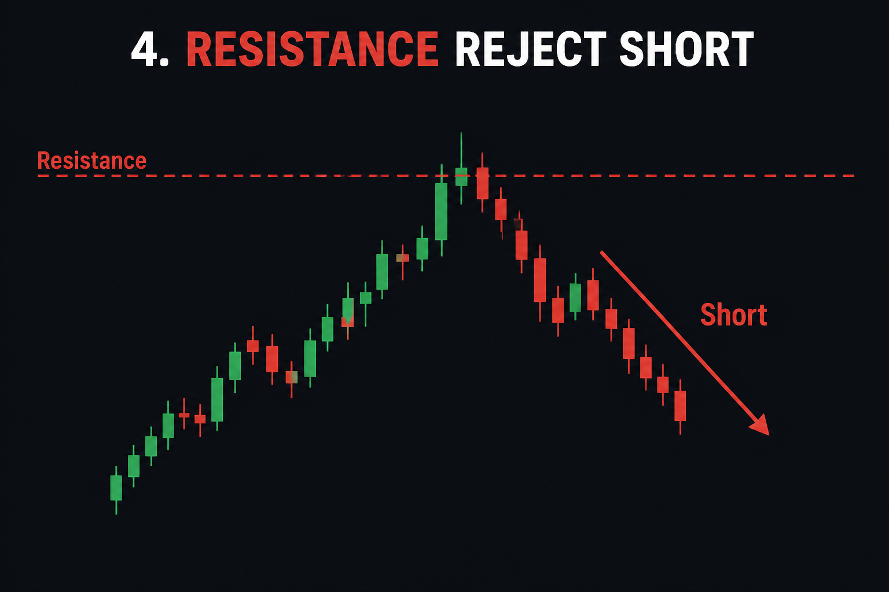
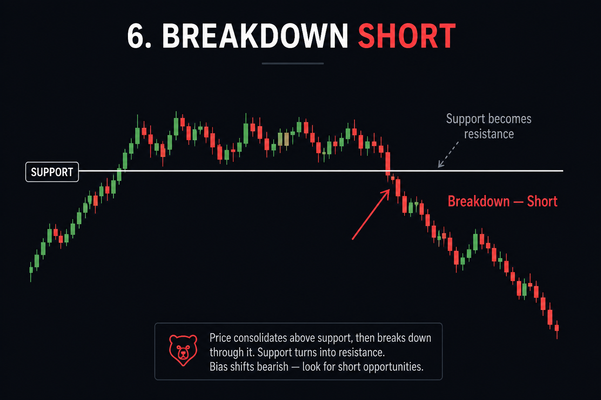
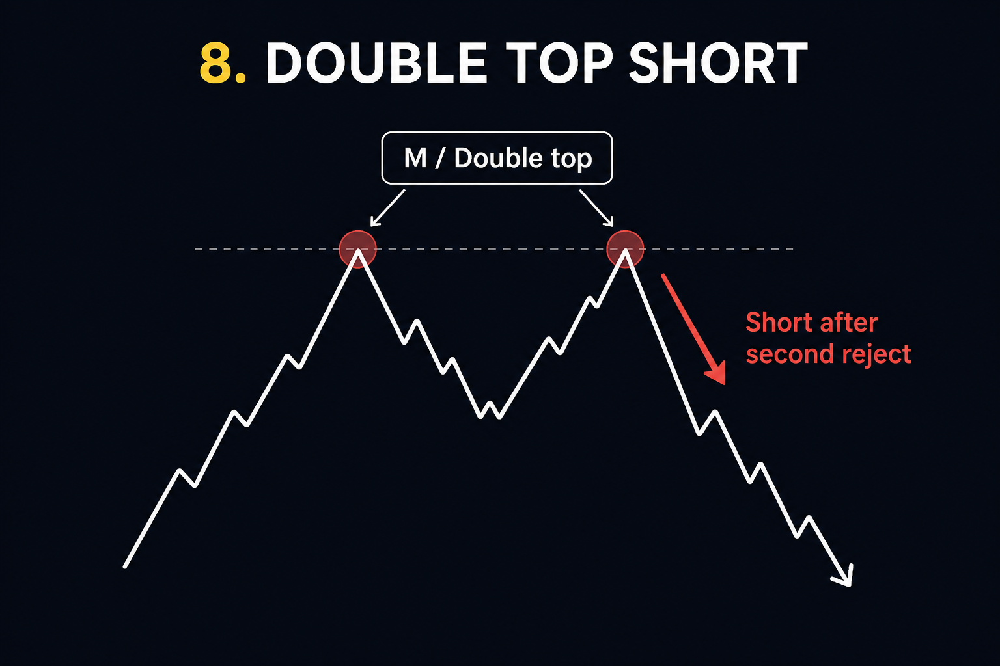

# Chart structures — longs vs shorts

Beginner picture guide for the shapes traders watch. These are **patterns**,
not guarantees — always use a stop and practice on paper first.

| Predicts | Structures in this folder |
| --- | --- |
| **Price tends UP → Long** | 01, 03, 05, 07 |
| **Price tends DOWN → Short** | 02, 04, 06, 08 |

---

## Quick read

1. Find the **stairs**: rising = long bias, falling = short bias.
2. Find the **walls**: bounce off a floor (support) → long; reject at a ceiling (resistance) → short.
3. Find the **break**: clear through a wall in the trend’s direction often continues that way.

---

## Long structures (bet it goes up)

### 01 — Uptrend (higher highs / higher lows)

**Picture:** rising staircase.  
**Why traders long:** buyers keep defending higher dips.  
**Invalidated when:** a higher-low breaks and you get a lower low.

### 03 — Support bounce

**Picture:** price dips to a floor and lifts.  
**Why traders long:** the floor held again.  
**Invalidated when:** price closes clearly under support.

### 05 — Breakout

**Picture:** price punches up through a ceiling.  
**Why traders long:** sellers at that level lost. Old resistance often becomes new support.  
**Invalidated when:** a fast “fakeout” snaps back under the broken level.

### 07 — Double bottom (W)

**Picture:** two similar lows, then lift (W shape).  
**Why traders long:** second dip failed to make a new low — selling pressure fading.  
**Invalidated when:** price breaks under both bottoms.

---

## Short structures (bet it goes down)

### 02 — Downtrend (lower highs / lower lows)

**Picture:** falling staircase.  
**Why traders short:** sellers keep capping rallies lower.  
**Invalidated when:** a lower-high breaks and you get a higher high.

### 04 — Resistance reject

**Picture:** price rises to a ceiling and fails.  
**Why traders short:** the ceiling held again.  
**Invalidated when:** price closes clearly above resistance.

### 06 — Breakdown

**Picture:** price punches down through a floor.  
**Why traders short:** buyers at that level lost. Old support often becomes new resistance.  
**Invalidated when:** a fakeout snaps back above the broken level.

### 08 — Double top (M)

**Picture:** two similar highs, then drop (M shape).  
**Why traders short:** second push failed to make a new high — buying pressure fading.  
**Invalidated when:** price breaks above both tops.

---

## How to use this with Harness

1. Open `/terminal` on **PAPER**.
2. Look at the chart: stairs up, stairs down, or a wall?
3. Match it to a picture above.
4. Set stop on the **other side** of the structure before you size.

This folder is teaching material only — not financial advice.
